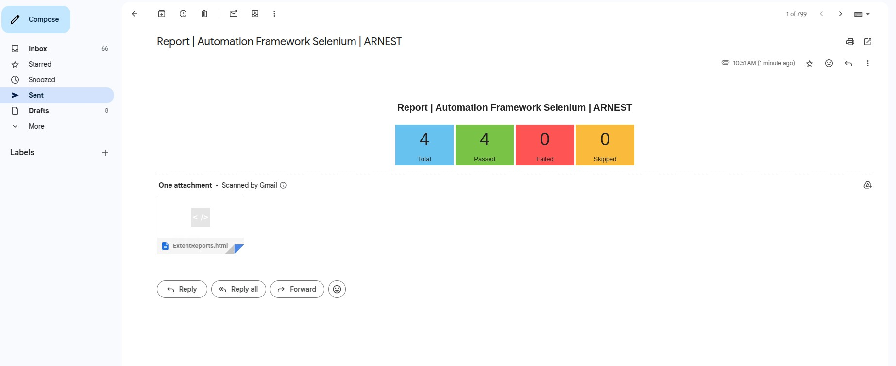

# Arnest Selenium TestNG Maven Automation Framework Documentation

## System Requirements

- Install **Java JDK** (Recommended: JDK >= 17)
- Install **Chrome Browsers**

## Project Overview

This framework uses **TestNG, Selenium, and Maven** to automate web applications with various features such as
reporting, email notifications, video recording, and data-driven testing.

### **Key Features**

- **WebUI**: The main keyword in the framework containing common functions.
    - Example Usage: `WebUI.setWindowSize(1024, 768)`, `WebUI.screenshotElement(By by, String elementName)`
- **Extent Report Integration**
- **Send Email after Test Execution** (with Report information and HTML attachment)
- **Record Video** (Success and failure)
- **Capture Screenshots** (Success and failure)
- **Data-Driven Testing** from Excel (`.xlsx, .csv, .json`)
- **Retry Failed Tests** using `IRetryAnalyzer` and `IAnnotationTransformer`
- **Executable JAR Support**

## How to Use

### **Generating and Running JAR File**

**Generate JAR File in Eclipse:**

1. Right-click on the project.
2. Select `Export` → `Runnable JAR file`.
3. Choose a destination and save it locally.

**Run Tests using JAR File**

- Execute all tests:
  ```sh
  java -jar test-automation.jar
  ```
- Run test cases by group:
  ```sh
  java -jar test-automation.jar -g <groupname>
  ```
- Run test cases by suite:
  ```sh
  java -jar test-automation.jar -s <suitename>
  ```
- Run suite with group:
  ```sh
  java -jar test-automation.jar -s <suitename> -g <groupname>
  ```

## Configuration Files

### **General Configuration**

```properties
VIDEO_RECORD=no
HEADLESS=true
EXTENT_REPORT_NAME=ExtentReports
EXTENT_REPORT_FOLDER=exports/ExtentReports
EXPORT_VIDEO_PATH=exports/ExportData/Videos
EXPORT_CAPTURE_PATH=exports/ExportData/Images
```

### **Email Configuration**

- Enable/Disable email notifications:
  ```properties
  send_email_to_users=true
  ```
- Configure SMTP settings:
  ```properties
  email.to={""}
  email.host=""
  email.server=""
  email.from=""
  ```
  **Note**: If using Gmail, set up an **App Password**.

### **Screenshot and Video Recording**

#### **Screenshot Capture Settings**

```properties
screenshot_passed_steps=yes
screenshot_failed_steps=yes
screenshot_skipped_steps=no
screenshot_all_steps=no
```

#### **Screen Recording & Image Path**

- **Video Path**: `exports/ExportData/Videos`
- **Images Path**: `exports/ExportData/Images`

## Extent Report Example


## Email Report Example



## Future Enhancements

- **Upload images and videos to cloud**
- **Integrate with Jira & Dev Board**
- **DevOps Integration**

## Contact Us

For any inquiries, feel free to contact us:

Company Name: Arnest – | Innovative Solution
Email: contactus@arnest.in
Website: https://arnest.in/


